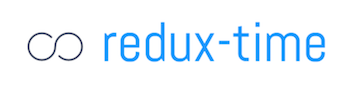
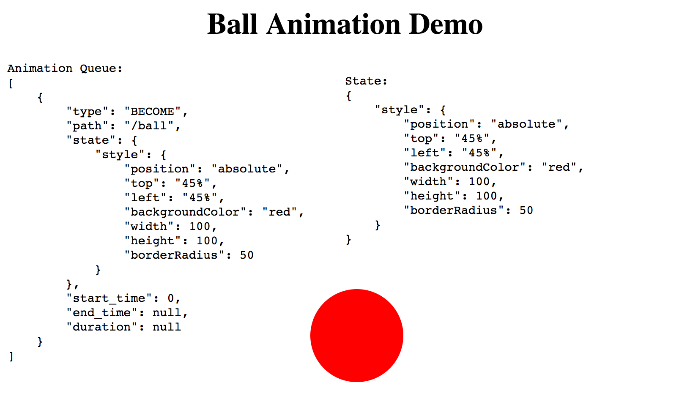

<p align="center">
    
</p>

# redux-time: Functional, declarative, redux animation  [](https://badge.fury.io/js/redux-time)  [](https://github.com/Monadical-SAS/redux-time) [](https://twitter.com/thesquashSH)

▶️ [Intro](#intro) | [Walkthrough](#walkthrough-example) | [Info & Motivation](#info--motivation) | [Links](#links) | [Documentation](#documentation) | [Examples](https://monadical-sas.github.io/redux-time/examples/) | [Source](https://github.com/Monadical-SaS/redux-time/)

`redux-time` is a library that allows you to compute your state tree as a function of time.  It's primarily used for animations, but it can also be used for generically changing any redux state as time progresses.

Generally, there are two different categories of animations on websites:

 - content transitions (e.g. effects when adding/deleting a list item, hover effects, photo gallery transitions, etc)
 - **full-blown interactive dynamic animations** (like in games)

`redux-time` is designed for the second case.  If you want simple CSS content transitions and aren't building complex videogame-style animations, check out [react-transition-group](https://facebook.github.io/react/docs/animation.html) instead.

```bash
yarn add redux-time    # 🎂
```
Check it out in action on the [full demo](https://monadical-sas.github.io/redux-time/examples/demo.html) page, or follow the [walkthrough example](#walkthrough-example) below.  
At [Monadical](https://monadical.com) we use `redux-time` for animating ethereum-backed browser-based poker ([come help us build it](https://monadical.com/apply)!).

<p align="center">
    <a href="https://monadical-sas.github.io/redux-time/examples/ball.html">
        <br/>
        Bouncing Ball Demo
    </a>
</p>

**[MORE LIVE DEMOS](https://monadical-sas.github.io/redux-time/examples/)**

## Key Features

- all state is a function of the current point in time
- time-travel debugging (e.g. slow down, reverse, jump to point in time)
- compose animations with pure functions e.g.: `Repeat(Rotate(...), 10)`
- define animations with a Javscript `tick` function or with CSS keyframes
- seamlessly animate existing React + Redux codebase without major changes
- animate any state tree value manually, or use provided Animation functions for common animations e.g.: `Translate`, `Rotate`, `Opacity`
- works in all browsers with `requestAnimationFrame` and in node with `setTimemout`
- it's fast! computing state takes about `0.5ms` per 100 active animations (the bottleneck is usually React & the DOM, check out [Inferno] + canvas if you really want speed!)
- fully compatible with CSS animation libraries like [Animate.css](https://daneden.github.io/animate.css/), you already have access to 1000s of pre-written animations out there that plug right into `redux-time`!

## Intro

Redux-time makes complex, interactive, composable animations possible by using the redux single-source-of-truth state tree model, and extending it with the idea of time.

Redux is already capable of time-travel currently, however you cant slow down the speed of time, reverse time, or jump to a specific point in time since redux only knows about the list of actions and has no first-class conept of time.  This library makes time a first-class concept, and gives you careful control over its progression.

What that means specifically, is that every time a `TICK` action is dispatched with a `current_timestamp` parameter, the `animations` reducer looks through the active animations in `animations.queue`, calls their respective `tick` functions with a `delta` parameter, and uses their output to render a state tree at that point in time.

Every tick function is a pure function of the `start_state`, `end_state`, and delta from `start_time`.  This makes animations really easy to reason about compared to traditional solutions.  Debugging is also drastically simpler, since you can slow down and even **reverse** the flow of time to carefully inspect animtion progress!

## Walkthrough Example

1. First we create a redux store, and start the animation runloop with our initial state

```javascript
import {createStore, combineReducers} from 'redux'
import {animations, startAnimation} from 'redux-time'

const initial_state = {
    ball: {style: {top: 0, left: 0}},
}
window.store = createStore(combineReducers({animations}))
window.time = startAnimation(store, initial_state)
```

2. Then we create a component to render our state

```javascript
import React from 'react'
import ReactDOM from 'react-dom'
import {connect, Provider} from 'react-redux'

const BallComponent = ({ball}) =>
    <div className="ball" style={ball.style}></div>

const mapStateToProps = ({animations}) => ({
    ball: animations.state.ball,
    // You could also merge the animated state with state you manage elsewhere in the tree.
})

const Ball = connect(mapStateToProps)(BallComponent)

ReactDOM.render(
    <Provider store={window.store}>
        <Ball/>
    </Provider>,
    document.getElementById('react')
)
```

3. Then we dispatch an animation to move the ball

```javascript
import {Translate} from 'redux-time/src/animations'

const move_ball = [
    Translate({
        path: '/ball',
        start_state: {top: 0, left: 0},
        end_state: {top: 100, left: 0},
        duration: 1000,
        // start_time: (new Date).getTime() + 500,   // optional, defaults to starting immediately
        // curve: 'easeOutQuad',                     // optional, defaults to 'linear'
        // unit: '%',                                // optional, defaults to 'px'
    })
]

window.store.dispatch({type: 'ANIMATE', animations: move_ball})
```

**You're done!** The proper intermediate state is calculated from the animation and rendered on every tick, and the ball moves on the screen!

See the demo of this code in action here: [ball.html](https://monadical-sas.github.io/redux-time/examples/ball.html), and the full code for the example in [`examples/ball.js`](https://github.com/Monadical-SaS/redux-time/blob/master/examples/ball.js)

## Info & Motivation

After spending almost a year contemplating how to do declarative animations cleanly at [Monadical](https://monadical.com), we realized that all state can be represented as layered patches that are a function of time.

On the way we tried many other solutions from using jQuery animations, to `react-transition-group`, to janky manual approaches w/ `setTimout`.  Since all those are designed with content transitions in mind, nothing really "clicked" and felt like a clean way to do interactive game animations.

Finally, we settled on the state tree as a function of time approach, and wrote some common animation definition functions, then ported our old UI over!  Given its drastic improvement on our codebase and productivity, we feel this library is worth taking a look at if you want to do game-style animations in a declarative, React-friendly manner.

## How it works

1. `redux-time` dispatches a `TICK` action on every `requestAnimationFrame`, which then hits the `animations` reducer.
2. In the animations reducer, `redux-time` uses the TICK's `current_timestamp` and each animation's `start_state` to compute the intermediate state generated by every animation.  Each animation has a function like: `tick(delta) => {return (delta/duration)*amt}` which is passed the delta from its `start_time`.
3. Finally, all the state produced from each active animation is merged into one object and some translation is done to convert `style`s from dictionaries of values to valid CSS strings (e.g. `{transform: {translate: {top: 0, left: 10}}}` -> `transform: translate(10, 0)`)
The dictionary is returned as the new `animations.state`, and redux then rerenders any components that got new values.

```javascript
// redux-time dispatches this for you on every requestAnimationFrame
store.dispatch({type: 'TICK', current_timestamp: 1499000000})

// then the redux-time animatons reducer uses your Translate's animation.tick(delta) func to calculate the animated state:
const new_state = {
    ball: {
        style: {top: 55, left: 0},
    },
}
```

Redux re-renders components automatcially whenever the state they subscribe to with `mapStateToProps` changes.  New animated state is immediately rendered after the `animations` reducer returns, and the position of the ball updates on the screen!
This process repeats on every animation frame, and the ball state changes on every `TICK` until the animtion finishes.

## Contributing

We'd love see PR's or issues opened if you have questions or suggestions!

If possible, when submitting an issue report, try to copy one of the `examples/` files and modify it to illustrate your reproduceable error.

## Further-Reading Links

- [React Docs on Animation](https://facebook.github.io/react/docs/animation.html)
- [React-Transition-Group](https://github.com/reactjs/react-transition-group/tree/v1-stable) library to add component lifecycle CSS transitions
- React-Transition-Group walkthrough article:  [UI Animations with React — The Right Way](https://medium.com/@joethedave/achieving-ui-animations-with-react-the-right-way-562fa8a91935)
- [GSAP](https://greensock.com/gsap): incredibly robust, stable, well-supported Javascript animations library
- [react-animations](https://github.com/FormidableLabs/react-animations) CSS animations usable with inline-style libraries like StyledComponents
- [react-animate](https://www.npmjs.com/package/react-animate) library for defining component transitions by extending the React.Component class
- React.rocks: [animation examples](https://react.rocks/tag/Animation)
- [Animate.css](https://github.com/daneden/animate.css/blob/master/animate.css): repository of great css animations (usable with redux-time)

# Documentation

Documentation is a work-in-progress, if you see anything unclear or incorrect, please submit a PR or issue!

We encourage you to follow along with the demos in `examples/` to see how the library works.  The examples are short and fairly easy to read!

- [Basics](#basics)
    + [Installation](#installation)
    + [Getting Started](#getting-started)
    + [Rendering Animated State](#rendering-animated-state)
    + [Animations API](#animations)
        * What is an animation?
        * What is an animation sequence?
        * Library-provided animations
        * Running & Queueing Animations
        * Delayed Animations
- [Advanced](#advanced)
    + [Writing JS Animations](#custom-animations)
        * Composing animations
        * Custom tick functions
        * Interactive animations
    + [Writing CSS Animations](#writing-css-animations)
        * CSS `transform` (very advanced)
        * CSS `animate` (very advanced)
- [Optimization](#optimization)
- [Troubleshooting](#troubleshooting)

## Basics

### Installation

```bash
yarn add redux-time
# OR
npm install --add redux-time
```

Then add this to your page's entry point, next to `createStore`:
```javascript
import {animations, startAnimation} from 'redux-time'

// add animations to your reducers
window.store = createStore(combineReducers({..., animations}))  

// start the animation runloop off with your initial_state
window.initial_state = {ball: {text: 'Hello world!'}}
window.time = startAnimation(window.store, window.initial_state)
```

### Getting Started

```javascript
// change some state value instantly
window.store.dispatch({type: 'ANIMATE', animation: Become({
    path: '/ball/text',
    state: 'An instant state change happened!',
    // start_time: (new Date).getTime(),     // optional, default is now
    // duration: Infinity,                   // optional milliseconds duration
})})

// animate some state value over time
window.store.dispatch({type: 'ANIMATE', animation: Animate({
    path: '/ball/text',
    start_state: 0,
    end_state: 100,
    start_time: (new Date).getTime() + 1000,  // begins after 1000ms
    duration: 10000,
    curve: 'easeInOutQuad',
})})

// use a provided JS animation
window.store.dispatch({type: 'ANIMATE', animation: Rotate({
    path: '/ball',
    start_state: 0,
    end_state: 360,
    duration: 10000,
})})

// use a CSS keyframe animation
window.store.dispatch({type: 'ANIMATE', animation: AnimateCSS({
    path: '/ball',
    name: 'blinker',
    duration: 10000,
    curve: 'linear',
})})
```

Follow the [Walkthrough Example](#walkthrough-example) above for a detailed guide, or jump right into the docs below!

### Rendering Animated State

Animated state is just normal state that lives under `animations.state` in your store's state tree.  To render a component that uses animated state, write a container that fetches the props it needs from the animated state tree.

```javascript
import React from 'react'
import {connect} from 'react-redux'

const SquareComponent = ({style}) =>
    <div style={style}>This square may blink</div>

const mapStateToProps = ({animations}) => ({
    style: animations.state.ball.style    
})

const Square = connect(mapStateToProps)(SquareComponent)
```

If you have some components that are not entirely animated and rely on some parts of your normal state tree, you can merge/mix-and-match the animated state with your normal state in `mapStateToProps`.

```javascript
const mapStateToProps = ({animations, users}) => ({
    style: animations.state.ball.style,
    text: (animations.state.ball.text
            ? animations.state.ball.text    // use animated state if present
            : `Hello ${users.logged_in_user.username}!`),  // default if not
})
```

Most animations will add `/style` to the path you provide in order to animate any CSS style values.  Make sure your component uses the `style` state produced in `animations.state`, otherwise nothing will move on your screen, even though the animations are working!

### Animations

An "animation" in `redux-time` is defined as an Array of normal JS objects with the following keys:

```javascript
[{
    type,        // human readable description, e.g. TRANSLATE or OPACITY
    path,        // an RFC-6902 style javascript patch path, e.g. /ball/style/top or /path/to/array/0
    start_time,  // ddetermines when animation is active, defaults to immediately (new Date).getTime()
    duration,    // duration of the animation in ms (Infinity is allowed)
    end_time,    // optional instead of duration (Infinity is allowed)
    start_state, // initial state of the animation, e.g. {top: 0, left:0}
    amt,         // total amount to add to the start_state, e.g. {top: 10, left: 0}
    end_state,   // optional instead of amt
    curve,       // timing interpolation curve, can be a custom function like bezier() or 'linear', 'easeInOutQuad', etc.
    unit,        // defaults to 'px', can also be 'vw', '%', 'em', null, etc.
    tick,        // function that takes delta from start_time and returns a computed state at that point in time, defaults to:
                 //  tick: (delta) => {
                 //      const progress = start_state + curve_func(delta/duration)*amt        
                 //      return `${progress}${unit}`
                 //  }      
}]
```

On each frame, `computeAnimatedState` in `reducers.js` runs through all the animation `tick` functions,
and applies the computed results as patches to the specified location `path` in the state tree.

A single animation object can only change one value in the state tree, that's why we've defined a unit of animation
as an array of multiple objects, so that several `tick` functions can be logically grouped together.  This is helpful
for cases such as `TRANSLATE_TO`, which is animation comprised of two animation objects: `TRANSLATE_TO_LEFT` and `TRANSLATE_TO_TOP`.

An "animation sequence" in `redux-time` is a list of several animations, defined as an Array of the Arrays above like so:
```javascript
[
    [{type: ROTATE, ...}], 
    [{type: TRANSLATE_TO_LEFT, ...}, {type: TRANSLATE_TO_TOP, ...}]],
    ...,
]
```

When queueing up an animation, you can pass either a single "animation" (Array), or an "animation sequence" (double-nested Array):
```javascript
// a single animation
store.dispatch({type: 'ANIMATE', animation: Become(...)})

// an animation sequence
store.dispatch({type: 'ANIMATE', animations: [Become(...), Translate(...), Rotate(...)]})
```
In practice, the double-nesting for sequences is seamless, because all functions which take and produce animations
operate on only their expected types, and throw helpful errors if you pass the wrong type.

Typically, you wont create animations objects by hand, but rather use some of the provided animation functions.

#### Provided Animation Functions

```javascript
import {...} from 'redux-time/src/animations' 

// Basics

    // set some state without animating.  not everything is animates, some stuff you want to have 
    // snap into place instantly. Become is the most common "animation" of all.
    Become({path, state, start_time, end_time=Infinity, duration=Infinity})

    // the building block of all others, just interpolates a raw value or object
    // over some time, at the specified path, with the specified tick function
    Animate({type, path, start_time, end_time, duration, start_state, end_state, amt, curve='linear', unit=null, tick=null})

// CSS Animations

    // animate an animation defined in CSS  .e.g  @keyframes blinker {from {opacity: 1.0;} to {opacity: 0.0;}}
    AnimateCSS({name="blinker", path, start_time, end_time, duration=1000, curve='linear'})

    // check out Animate.css for awesome animations to use with this ^
    // https://github.com/daneden/animate.css

// JS Animations

    // move an element relative to its current position, using transform: translate(x, y)
    Translate({path, start_time, end_time, duration=1000, start_state, end_state, amt, curve='linear', unit='px'})

    // move an element's absolute or fixed position using {top, left}
    TranslateTo({path, start_time, end_time, duration=1000, start_state, end_state, amt, curve='linear', unit='px'})

    // aniamte an element changing opacity
    Opacity({path, start_time, end_time, duration, start_state, end_state, amt, curve='linear', unit=null})

    // rotate an element using transform: rotate(deg)
    Rotate({path, start_time, end_time, duration, start_state, end_state, amt, curve='linear', unit='deg'})

    // have an idea? contribute an animation by submitting a PR to src/animation.js
    // .e.g Wobble({...}), Bounce({...})

// Composable Higher-Order Animations (aka functions)

    // make each animation in a sequence start after the last one ends
    Sequential(animations, start_time)

    // repeat a single animation or set of animations simultaneously
    Repeat(animations, repeat=Infinity)
    
    // repeat a sequence of animations in order
    RepeatSequence(animations, repeat, start_time)

    // reverse a single animation or set of animations simultaneously
    Reverse(animations)
    
    // reverse a sequence of animations in order
    ReverseSequence(animations, start_time)
```

#### Running & Queueing Animations

To up queue an animation that you want to run, dispatch the `ANIMATE` action:
```javascript
// for a single animation, use animation:
store.dispatch({type: 'ANIMATE', animation: Become({...})})

// for a sequence of animations (most common), use animations:
store.dispatch({type: 'ANIMATE', animations: [...]})
```

**Delayed Animations**

To queue an animation that you don't want to have start immediately, just set the `start_time` of your animation to something before you dispatch it:

```javascript
const delayed_rotate = Rotate({
    path: '/square',
    start_time: (new Date).getTime() + 1000,   // to start 1sec from now
    duration: 1000,
    start_state: 0,
    amt: 360,
})
store.dispatch({type: 'ANIMATE', animation: delayed_rotate})
```

You can use `start_time` to build up a sequence of animations that overlap or run in a particular order.  You can also use the [`Sequence`](#composing-existing-animations) function to create a list of sequential animations that run one by one.

## Advanced

### Custom Animations

#### Composing Existing Animations

We provide several `animations.js` functions that operate on "animation sequences", a.k.a lists of animations, but you can also write your own.

- `Sequential`: play a list of animations one after another (so you dont have to do math on `start_time` manually)
- `Repeat`: repeat an animation or list of animations
- `RepeatSequence`: repeat a list of animations in order
- `Reverse`: reverse the direction of a single animation
- `ReverseSequence`: reverse a list of animations in order

Here's an example of using `Sequential` and `RepeatSequence` together:
```javascript
const bounce_ball = Sequential([
    Translate({
        path: '/ball',
        start_state: {top: 0, left: 0},
        end_state: {top: 100, left: 0},
        duration: 500,
    }),
    Translate({
        path: '/ball',
        start_state: {top: 100, left: 0},
        end_state: {top: 0, left: 0},
        duration: 500,
    }),
])
store.dispatch({type: 'ANIMATE', animations: RepeatSequence(bounce_ball, 10)})
```

#### Custom JS Tick Functions

If you don't want to use one of the provided animations in `animations.js`, or if you want to write your own, just pass a custom tick function to `Animate()`.
```javascript
store.dispatch({type: 'ANIMATE', animation: Animate({
    path: '/path/to/your/state/value',
    duration: 1000,
    start_state: 0,
    amt: 100,
    tick: (delta) => {
        // e.g. stepped value instead of smoothly changing continuous value
        if (delta <= 0) return 0
        if (delta <= 250) return 25
        if (delta <= 500) return 50
        if (delta <= 750) return 75
        if (delta <= 1000) return 100
    }
})})
```

#### Interactive Animations

You can also use custom tick functions to do interactive animations, e.g. [a ball that follows the user's mouse](https://monadical-sas.github.io/redux-time/examples/ball.html).  Interactive animations are by definition impure (since they depend on real-time user input), so time travel will not work to rewind/fast-forward them.

```javascript
window.onmousemove = (e) => {
    window.mouseY = e.pageY
    window.mouseX = e.pageX
}
store.dispatch({type: 'ANIMATE', animations: [
    Animate({
        path: '/ball/style/top',
        duration: Infinity,
        tick: () => window.mouseY - 50
    }),
    Animate({
        path: '/ball/style/left',
        duration: Infinity,
        tick: () => window.mouseX - 50
    }),
]})
```

### Writing CSS Animations

To write a custom CSS animation, first define a `@keyframe` animation in your CSS file:
```css
@keyframes blinker {
    from  {opacity: 1.0;}
    to    {opacity: 0.0;}
}
```

Then write a component to render:
```javascript
import React from 'react'
import {connect} from 'react-redux'

const SquareComponent = ({style}) =>
    <div style={style}>This square will blink</div>

const mapStateToProps = ({animations}) => ({
    style: animations.state.ball.style    
})

const Square = connect(mapStateToProps)(SquareComponent)
```

Then, dispatch an `AnimateCSS` animation to use your `@keyframe` animation:
```javascript
const blink = [
    AnimateCSS({
        path: '/ball',     // AnimateCSS will set /ball/style/animation/blinker
        name: 'blinker',   // name of the keyframe animation above
        duration: 1000,    // duration of the animation in milliseconds
        curve: 'linear',   // see all options in src/util.js: EasingFunctions
    })
]
store.dispatch({type: 'ANIMATE', animations: blink})
```

#### Manual Animations for CSS `transform`

You can animate CSS transform functions by using one of the provided animation functions like `Rotate` or `Translate`.  The following is only for **advanced** manual control over the CSS transform strings produced.

To manually animate a transform value, specify a path like so:

```javascript
Animate({
    path: '/ball/style/transform/translate3d',   
    start_state: {x: 0, y: 0, z: 0},
    ... 
})
```
All patches are stored internally as a dictionary of `{transform_function_name: value}`, but they get converted to strings when the animated state is calculated on every `TICK`.

Your component will receive `style={transform: 'translate3d(x, y, z)}` as a valid CSS string, so you can plug it right in with `style={style}` and it will work.

You can also animate multiple transform functions to be applied at once:
```javascript
Animate({
    path: '/ball/style/transform/translate3d',
    start_state: {x: 0, y: 0, z: 0, order: 0},   // lower order key comes first
    ... 
})
Animate({
    path: '/ball/style/transform/rotate3d',
    start_state: {x: 0, y: 0, z: 0, order: 1},
    unit: 'deg',
    ... 
})
```
Which gives a string like this to your component:
```javascript
style={transform: 'translate3d(0px, 0px, 0px) rotate3d(0deg, 0deg, 0deg)'}
```

The function wich merges all the transform functions into a final string is called `flattenTransform` in `src/util.js`.

#### Manual Animations for CSS `animation`

You can animate CSS animations normally by using `AnimateCSS`.  The following is only for **advanced** manual control over the CSS animation strings produced.

To manually set or animate a CSS animation value, specify a path like so:

```javascript
Become({
    path: '/ball/style/animation/css_animation_name',  // name of the @keyframe
    state: {
        name: css_animation_name,
        duration: 1000,
        delay: 100,
        playState: 'paused',
    }
})
```
All CSS animations are stored internally as a dictionary of `{css_animation_name: {name, duration, delay, playState}}`, but they get converted to strings when the animated state is calculated on every `TICK`.

Your component will receive `style={animation: 'blink 1000ms linear -25ms paused'}` as a valid CSS string, so you can plug it right in with `style={style}` and it will work.

You can also set multiple css animations to be applied at once:
```javascript
Become({
    path: '/ball/style/animate/fadeInRed',
    start_state: {..., order: 0},   // lower order key comes first
    ... 
})
Become({
    path: '/ball/style/animate/flipInX',
    start_state: {..., order: 1},
    ... 
})
```
Which gives a string like this to your component:
```javascript
style={animation: 'fadeInRed 1000ms -25ms paused, flipInX 1000ms -25ms paused'}
```

`paused` is used with negative delays to let us step through the animation frame-by-frame instead of letting the GPU render it continuously on another thread.  It's needed in order to let `TICK` render each specific frame when needed via javascript.

The function which merges all the animation functions into a final string is called `flattenAnimation` in `src/util.js`.

### Optimization

In our [benchmarks](https://github.com/Monadical-SAS/redux-time/blob/master/warped-time/examples/stress-test.js) `redux-time` can compute state for 100 animations in about 0.5ms.  This means that the bottneck for computing animations is usually going to be in React and the DOM (recalculating styles, paint, etc), not `redux-time`.

These are some great articles on optimizing react/redux code in general:
- https://marmelab.com/blog/2017/02/06/react-is-slow-react-is-fast.html
- https://reactrocket.com/post/react-redux-optimization/
- http://redux.js.org/docs/recipes/ComputingDerivedData.html

**React Optimization**

Step one is to make sure you've taken care of all the low-hanging-fruit react optimization in the articles above.

**Redux Optimization**

Make your React components purely functional, and use `mapStateToProps` to compute all the state needed for rendering.  That way components only re-render when their parameters actually change.

Make sure you understand how `shallowEquals` works in `react-redux`, and make sure that your props values have the same reference if they haven't changed, and a different reference if they have.  Mutation is the root of all evil!

**Redux-Time Optimization**

We take care of most of the optimization for you.  Animations are only computed if they aren't overwritten by other animations, and patches are only computed for the currently active animations.  Our internal functions are memoized and optimized to be JIT-ed.

If you encounter high memory use, try reducing `animations.max_time_travel` to something low such as `100`.  This will prevent you from going as far forwards/back in time, but it will use less memory.

If you see a particular slowdown that you think is in `redux-time`, please submit an issue and we'll gladly take a look!

## Troubleshooting

WIP

---


MIT License | [Monadical](https://monadical.com) SAS 2017 ([we're hiring!](https://monadical.com/apply))


